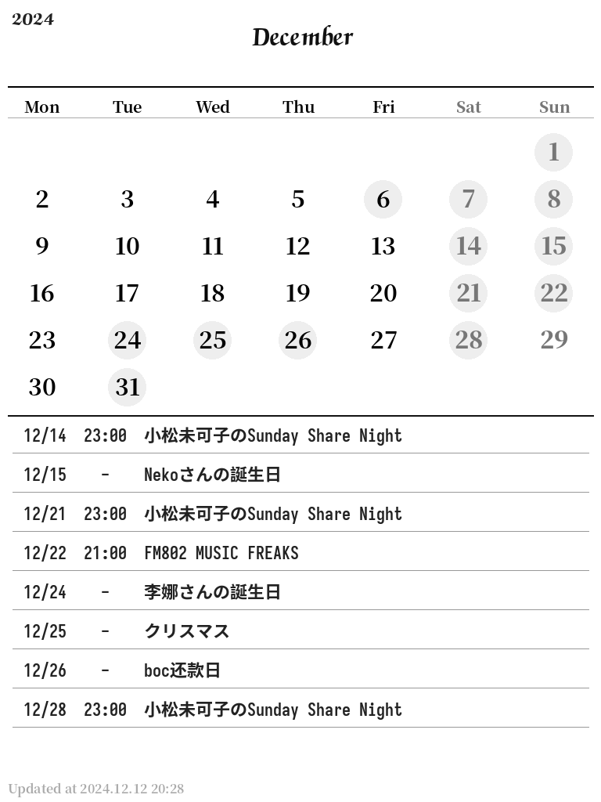

# Calendar Image Generator for kpw2

[原始readme](README_orig.md)

新增[kindlepw2.py](kindlepw2.py)，生成1024x768，也就是kindle paperwhite 2屏幕像素大小的，文件格式为PNG。

使用字体：
Chancery Bold
SarasaFixedHC-Bold
SourceHanSerif-Bold
SourceHanSerif-Heavy

效果图：

