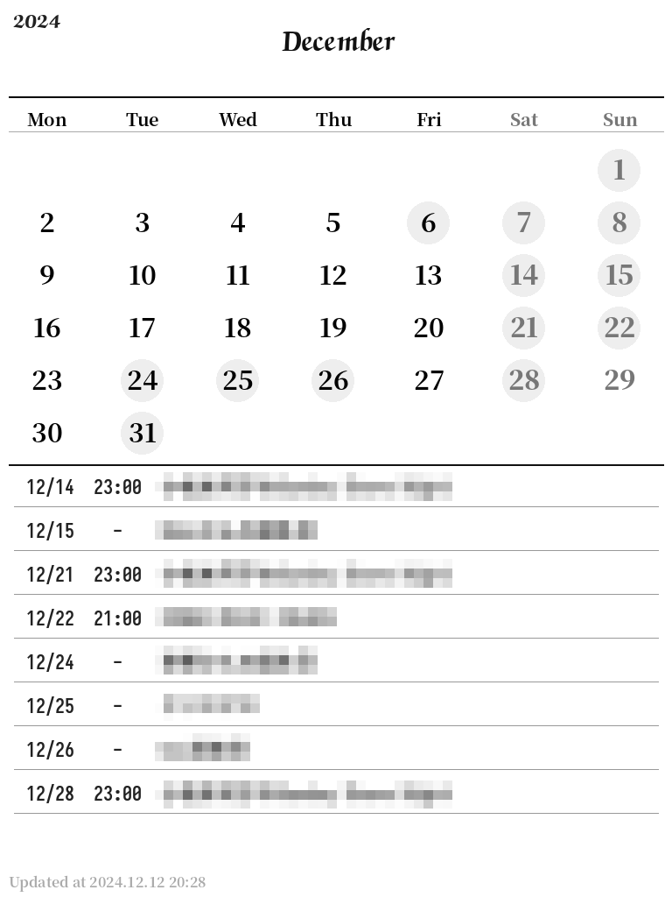
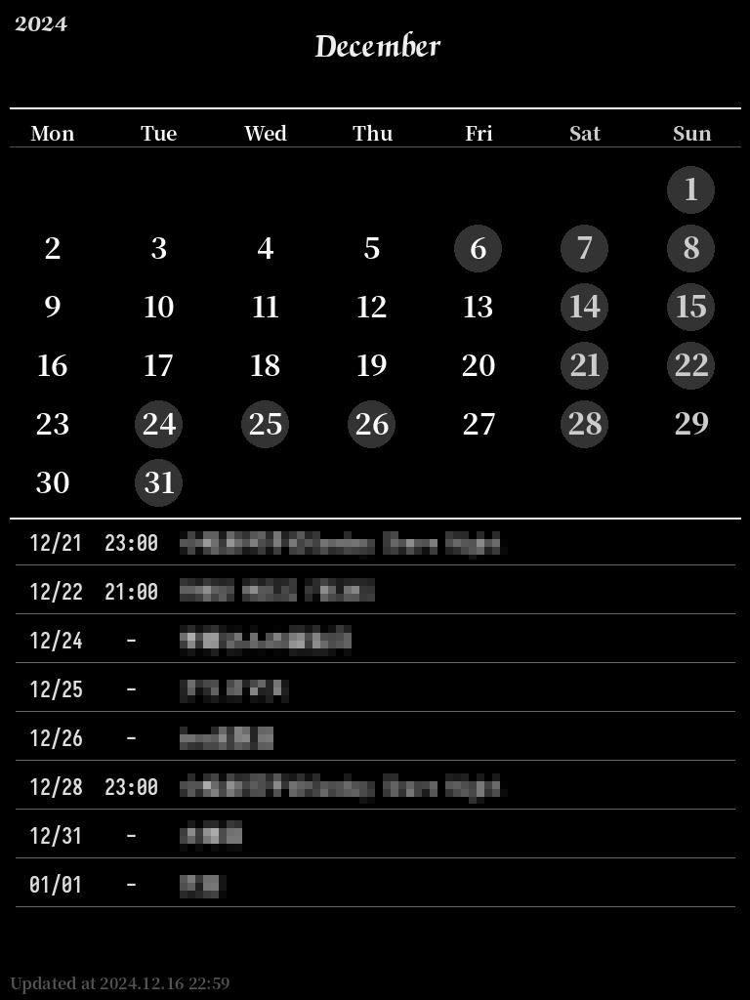

### Calendar Image Generator for kpw2

[原始 readme](README_orig.md)

新增 [kindlepw2.py](kindlepw2.py)，生成 1024 x 768，也就是 kindle paperwhite 2 屏幕像素大小的图片，文件格式为 PNG。

新增 [kindlepw2_black.py](kindlepw2_black.py)，生成反色版图片。

#### 使用字体：

* Chancery Bold
* SarasaFixedHC-Bold
* SourceHanSerif-Bold
* SourceHanSerif-Heavy

#### 效果图：

   
